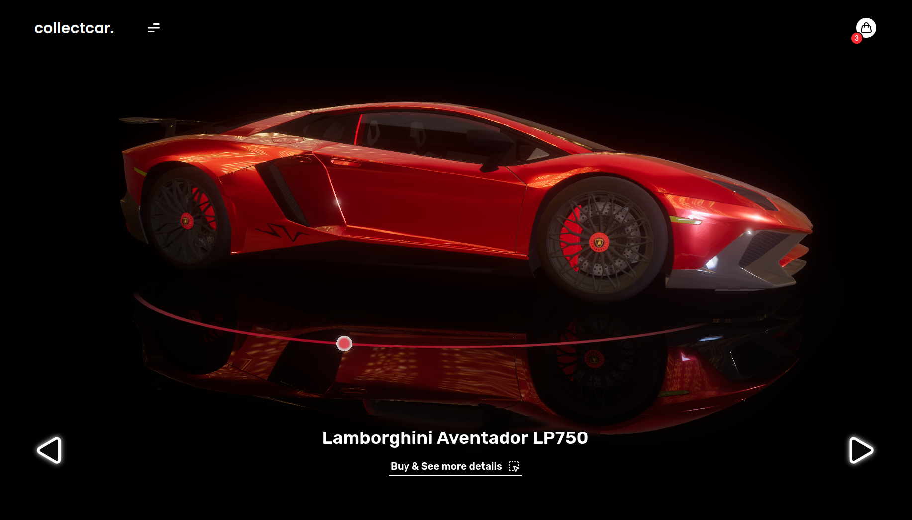
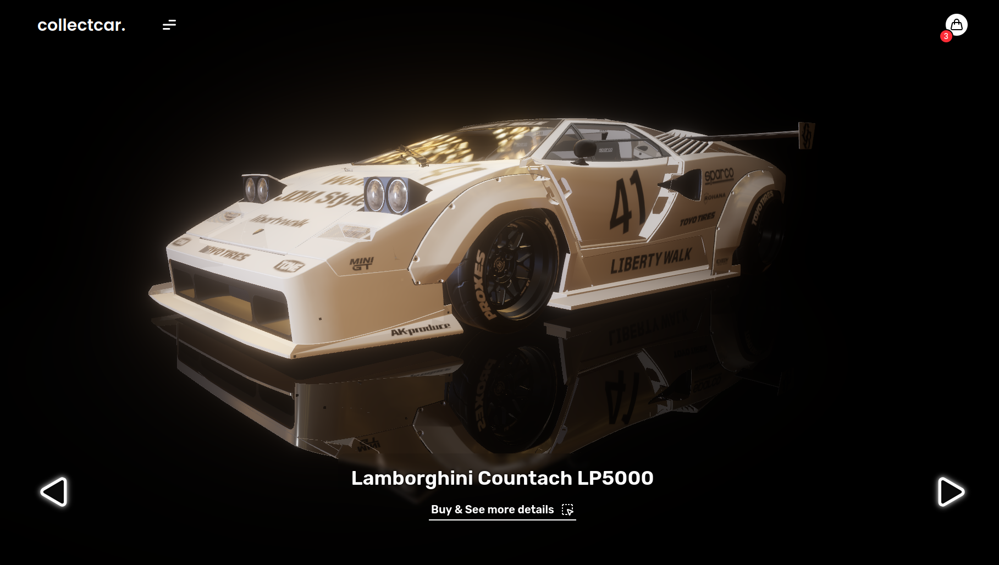

<div align="center">

# collectcar.

**Explore and purchase high-end vehicles through immersive, real-time 3D inspections 🚗**

</div>

<br />




# Development

**Clone this repository locally:**

```sh
git clone https://github.com/PeterLesiak/collectcar
cd ./collectcar
```

**Install dependencies:**

```sh
# If you have corepack enabled
corepack install

pnpm install
```

**Start the local server for development or production:**

```sh
# Development
pnpm dev
pnpm lint
pnpm format

# Production
pnpm build
pnpm preview
```
